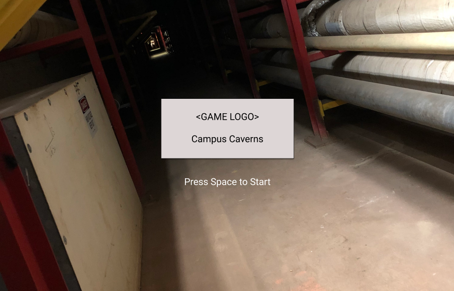
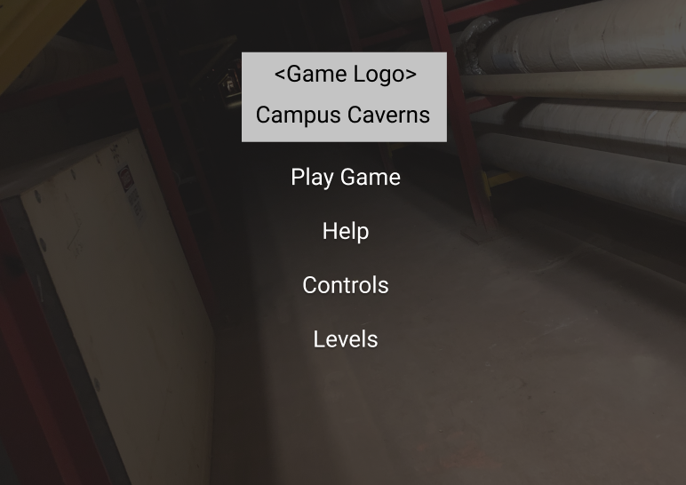
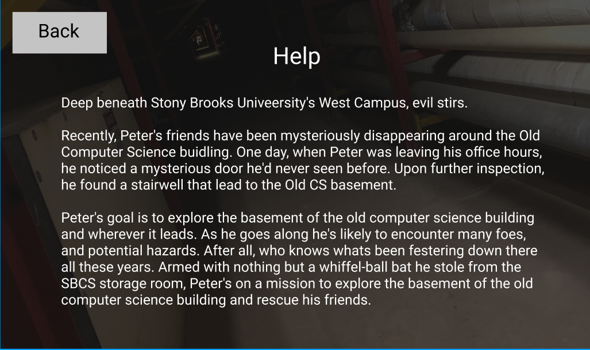

# Campus Caverns Game Design Documentation
A 2D top-down ish dungeon crawler game by Peter Walsh, Jeffery Tsang, Han Lin.

## Introduction

## Backstory
Deep beneath Stony Brooks University's West Campus, evil stirs. 

Recently, Peter's friends have been mysteriously disappearing around the Old Computer Science buidling. One day, when Peter was leaving his office hours, he noticed a mysterious door he'd never seen before. Upon further inspection, he found a stairwell that lead to the Old CS basement.

## Objective

Peter's goal is to explore the basement of the old computer science building and wherever it leads. As he goes along he's likely to encounter many foes, and potential hazards. After all, who knows whats been festering down there all these years. Armed with nothing but a whiffel-ball bat he stole from the SBCS storage room, Peter's on a mission to explore the basement of the old computer science building and rescue his friends.

## Game Controls

* **A** - Move left
* **S** - Move down
* **D** - Move right
* **W** - Move Up
* **SPACE** - Attack
* **ESC** - Pauses the game and displays a small window with two options. 

    1. Continue - unpauses the game
    2. Main Menu - returns the player to the main menu
    3. Help/Controls - displays a small popup with the game controls listed out

## Gameplay

The game will be played in a top-down fashion, but not completely top-down. You will get a complete 2D view of your character (ie. you won't just be looking down at the heads of the enemies and player).

Peter (the player) will be loaded into the first level at some initial starting position (TBA). From here, Peter will be able to traverse through the levels playing area. Within the play area there are several enemies the Peter will have to fight, or sneak around.

To exit/move between levels, Peter will have to defeat the areas boss, who will drop a special key that can be used to unlock the door to the next area.

Several of Peter's friends have been scattered and taken captive by the level areas boss. Peter doesn't have to rescue all of his friends to move onto the next level, however, every rescued friend will give Peter some sort of buff (be that health, speed, or strength).

## AI

How the AI in the game work is going to be different for each type of enemy in the game. There will also have to be some kind of boss specific AI system in place for the bosses. More details about this coming soon.

## Graphical User Interface

The graphical user interface for the screens will be as follows:

* Splash Screen - will just display the game's logo and game name, with a single button that say "Start"

* Main Menu - the main menu will have the following visual elements
    1. A background image of the tunnels
    2. A cavelike border around the edge of the screen
    3. A "Play" button that loads the player into the first level of the game
    4. A "Controls" button that loads the a page describing the controls to the player
    5. A "Levels" button that will allow the player to select any level of the game they have unlocked to play
    6. A "Credits" button that will display the credits for the game. Includes all of us (the devs) and McKenna the the TAs who worked on the game engine. Includes software used to develop the game.
    7. A "Story" button that gives the player some backstory on the game and what it's about

## Player UI/HUD

The in-game player heads up display will display the following items to the player:

1. The Player's health (as a number). Visual health bar would be an added bonus
2. Number of each type of enemy killed. We only display the label if count > 0. 
3. Friends rescued. The number of Peter's friends he's found/rescued from tunnels.
4. The level that the player is on (as a number)

More HUD items TBA. In general we probably want to keep the HUD as minimal as possible, to keep try and the experience as immersive as possible.

## Artwork

All artwork for the game is going to have to be original. We need to create/develop the following:

### Sprites
* Peter - our main character/protagonist. He's going to be a simple animated sprite (size TBA) with the following animations:

    1. Walking left
    2. Walking right
    3. Walking up
    4. Walking down
    5. Attacking left
    6. Attacking right
    7. Attacking up
    8. Attacking down
    9. Taking damage
    10. Dying

* Rat - one of the critters crawling around in the tunnels. Also an animated sprite (size TBA):

    1. Walking left
    2. Walking right
    3. Walking up
    4. Walking down
    5. Attacking left
    6. Attacking right
    7. Attacking up
    8. Attacking down
    9. Taking damage
    10. Dying

* Monkey - a few of the monkeys that were in Old CS in the early 2000s escaped into the tunnels. Also an animated sprite (size TBA) with the following animations:

    1. Walking left
    2. Walking right
    3. Walking up
    4. Walking down
    5. Attacking left
    6. Attacking right
    7. Attacking up
    8. Attacking down
    9. Taking damage
    10. Dying

### Tiles and Tilesets

The game will have approximately six levels. Each level will have it's own unique tileset and tiles.

#### Tilesets

Each level will in the game will have it's own tileset that conforms (generally) to the themes of the game levels which are as follows:

1. **Old CS Basement**. Just concrete, pipes and mold.
2. 
3.
4. **Library Basement**. Old books/bookshelves and cobwebs. Wooden theme?
5.
6. **Jatvits Lecture Basement/Bunker**. Some kind of fallout shelter or secret nuclear bunker. Maybe very modern theme?

#### Tiles

There will be one tileset per level in the game. Besides conforming to the theme of the level, each tileset should have the following tiles:

* Floor Tile - the basic floor tile of the level. Should have a little bit of an outline.
* Wall tiles - should fit the theme of the room. More details TBA.
* Outline tiles - clearly define the playable space that the player can play in. Because the levels will attempt to simulate a 3D box of sorts, we want clear boundries indicated to the player. These will be the same for every tileset.

## Sound Effects
TBA

## Game Music
TBA

## Mockup Diagrams

### Splash
This is our mockup diagram for our games splash screen. The logo is a work in progress.

### Main Menu
This is our mockup diagram for the main menu of our game. We're working on the game logo right now, it will go in place of the game logo tag. The background has been faded a little bit, this is intentional.

### Controls
This is our controls screen. It's pretty similar to the control screens of the games we did for homework.

### Levels
This is the format for our levels selection page. There will be 6 levels as per the assignment specification. There is a back button to return to the main menu. Each level will have a small image preview of the level.

### Help
The help page will have basically just one text box with a description of the games story and a back button that brings the player back to thee main menu. 

